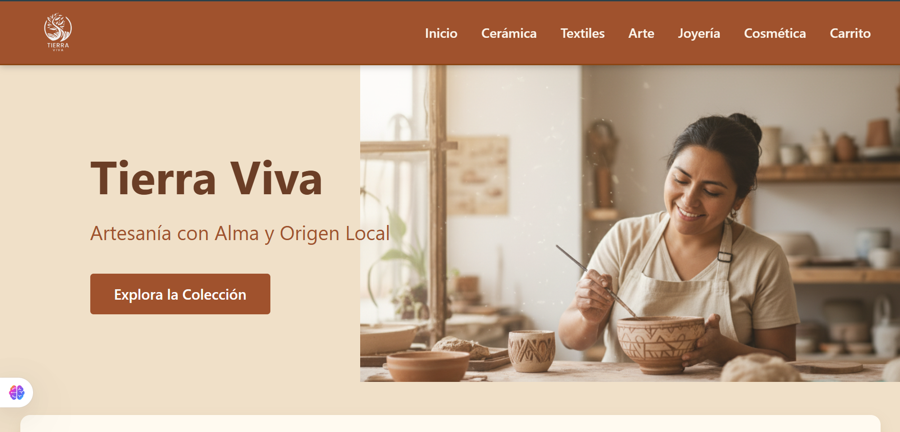
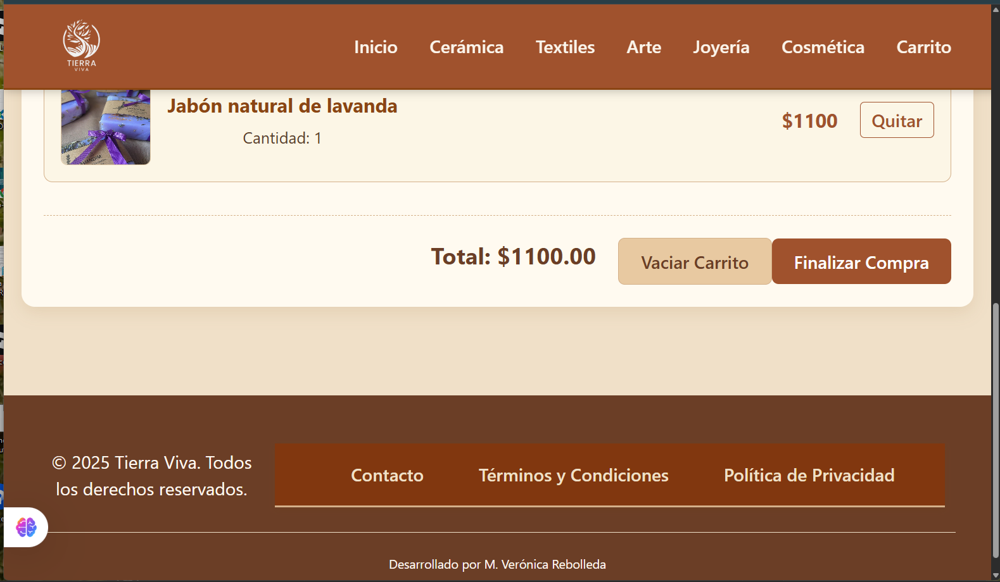

# 🛍️ E-Commerce de Artículos Artesanales  

Este proyecto es un **eCommerce de artículos artesanales**, desarrollado con **React + Vite**.  
Forma parte de una **pre-entrega de estudios** para el programa **Talento Tech**.  

Actualmente el proyecto se encuentra **en construcción**, y se irán implementando progresivamente **nuevas funciones, mejoras visuales y optimizaciones de código**.

---

## 🎯 Objetivo del Proyecto

Desarrollar una aplicación funcional que simule una tienda online con carrito de compras, conexión a datos mediante una API local y navegación dinámica entre secciones y productos.

---

## ⚙️ Tecnologías Utilizadas

- **React.js** (con Vite)
- **JavaScript (ES6+)**
- **HTML5 / CSS3**
- **React Router DOM**
- **Hooks (useState, useEffect)**
- **JSON local (products.json) como fuente de datos**

---

## 🧩 Requerimientos del Proyecto

### 🧺 Requerimiento #1: Carrito de Compras

- Crear una **funcionalidad básica** para el manejo del carrito.  
- Componente para **listar productos disponibles**.  
- Uso del **hook `useState`** para manejar el estado del carrito.  
- Implementación de un evento de clic que permita **agregar productos al carrito**.  
- Componente separado para **mostrar el carrito con los productos seleccionados**.  
- Creación de un **Layout general** del eCommerce.

---

### 🔗 Requerimiento #2: Conexión a una API

- **Integración con una API local** (mediante un archivo `products.json` que provee la información de los productos).  
- Implementación de **estado de carga y manejo de errores**.  
- Gestión del estado con **useState**.  
- Actualización del **diseño visual del eCommerce**.  
- Uso de **useEffect** para efectos secundarios.  
- **Ampliación del carrito** de compras.

---

### 🧭 Requerimiento #3: Integración de Rutas

- Implementación de **rutas** con **React Router DOM**.  
- Manejo de **estado de carga y errores**.  
- Creación de un **componente para cada sección** (productos, carrito, contacto, etc.).  
- **Navegación** entre productos y secciones.

---

### 🔐 Requerimiento #4: Rutas Dinámicas y Protegidas

- Implementación de **rutas dinámicas** para visualizar productos individuales.  
- **Interactividad** mejorada en la navegación.  
- **Rutas protegidas** para secciones específicas (por ejemplo, acceso al carrito o perfil de usuario).  
- Creación de una **Navbar** funcional y adaptativa.

---

## 🚀 Estado del Proyecto

🧱 **Versión actual:** Pre-entrega  
🔧 **Estado:** En desarrollo — se agregarán mejoras de diseño, autenticación y conexión a API externa.  
🎨 **Próximos pasos:**
- Incorporar sistema de autenticación.  
- Mejorar la experiencia del usuario y el diseño responsivo.  
- Integrar base de datos o API real.  

---

## 👩‍💻 Autor

**Desarrollado por:** María Verónica Rebolleda.  
**Programa:** Talento Tech – Frontend React.  
📅 **Año:** 2025  

---

## 📸 Vista previa (en construcción)

  
  

---

✨ _Gracias por visitar este proyecto. ¡Toda sugerencia es bienvenida!_

# React + Vite

This template provides a minimal setup to get React working in Vite with HMR and some ESLint rules.

Currently, two official plugins are available:

- [@vitejs/plugin-react](https://github.com/vitejs/vite-plugin-react/blob/main/packages/plugin-react) uses [Babel](https://babeljs.io/) (or [oxc](https://oxc.rs) when used in [rolldown-vite](https://vite.dev/guide/rolldown)) for Fast Refresh
- [@vitejs/plugin-react-swc](https://github.com/vitejs/vite-plugin-react/blob/main/packages/plugin-react-swc) uses [SWC](https://swc.rs/) for Fast Refresh

## React Compiler

The React Compiler is not enabled on this template because of its impact on dev & build performances. To add it, see [this documentation](https://react.dev/learn/react-compiler/installation).

## Expanding the ESLint configuration

If you are developing a production application, we recommend using TypeScript with type-aware lint rules enabled. Check out the [TS template](https://github.com/vitejs/vite/tree/main/packages/create-vite/template-react-ts) for information on how to integrate TypeScript and [`typescript-eslint`](https://typescript-eslint.io) in your project.
